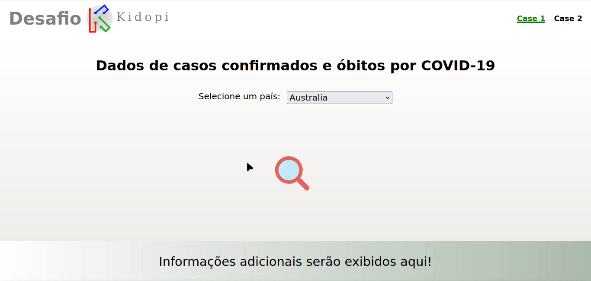
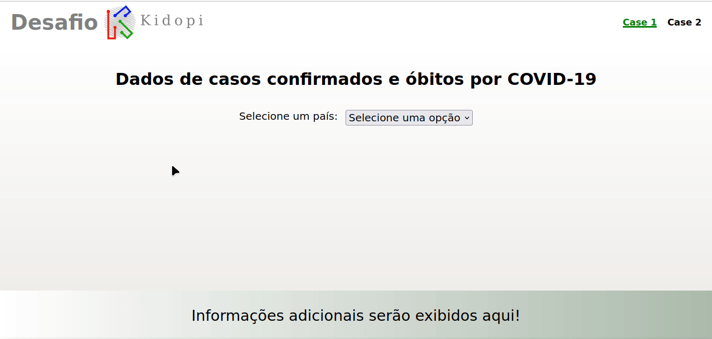

<h1 align="center">
  Desafio Kidopi
</h1>
<div align="center">

  <h3>Construido com</h3>

  
  
  
  
  
  
  
  

  <!-- Badges source: https://dev.to/envoy_/150-badges-for-github-pnk -->
</div>

<br/>

# Sumário

- [Entrega feita](#done)
- [Páginas do FrontEnd](#front-end)
  - [Casos de covid por país escolhido](#front-end-home)
  - [Diferença entre taxa de mortes](#front-end-diff)
- [Documentação das rotas da API](#api)
  - [Registrar data e hora de acesso a API-Covid-19](#post-covid-stats)
- [Rodar localmente](#run)
- [Rodar os testes](#tests)

#

<div id='done'/>

# Entrega feita

- FrontEnd feito com React (junto com TypeScript)
  - Layout responsivo
- BackEnd feito com Laravel (PHP)
  - As validações das requisições são feitas pelo FormRequest
  - O banco de dados é o MySql
- Testes
  - E2E: usando o Cypress
  - Unitário: Com 100% de cobertura na camada de serviços
  - Integração: Com 100% de cobertura nas rotas

#

<div id='front-end'/>

# Páginas do FrontEnd

O layout foi feito para telas de desktop e de mobile.

<div id='front-end-home'/>

## Casos de covid por país escolhido

Nessa página é possivel:

- Vizualizar as mortes (confirmadas ou não) pela Covid-19 entre Australia, Brasil e Canada
  - É possivel filtrar por estados
- Vizualizar, no rodapé da página, a data da pesquisa

<table>
  <tr>
    <td valign="top"></td>
  </tr>
</table>

#

<div id='front-end-diff'/>

## Diferença entre taxa de mortes

Nessa pagina é possivel:

- Vizualizar a diferença entre taxa de mortes pela Covid-19 entre dois países
- Vizualizar a data da pesquisa no rodapé da página

<table>
  <tr>
    <td valign="top"></td>
  </tr>
</table>

#

<div id='api'/>

# Documentação das rotas da API

<div id='post-covid-stats'/>

## Registrar data e hora de acesso a API-Covid-19

Rota para registrar o acesso a API-Covid-19

```http
POST /api/covid-stats
```

<h3>Mandar pelo body da requisição (json):</h3>

| Parâmetro     | Tipo     | Descrição                                            |
| :------------ | :------- | :--------------------------------------------------- |
| `country`     | `string` | **Obrigatório**                                      |
| `search_date` | `date`   | **Obrigatório**, **No formato: YYYY-MM-DD HH:mm:ss** |

<h2>Respostas:</h2>

<h3>Em caso de erro:</h3>

| Status code | Causa                             |
| :---------- | :-------------------------------- |
| `400`       | _Requisição no formato incorreto_ |

<h3>Em caso de sucesso:</h3>

- Status code
  - 201
- Retorno:

```json
{
  "id": 1,
  "country": "Brazil",
  "search_date": "2023-03-20",
  "created_at": "2023-03-20T14:39:39.000000Z",
  "updated_at": "2023-03-20T14:39:39.000000Z"
}
```

#

<div id='run'/>

# Rodar localmente

Versões:

- Node 18.15.0
- PHP 8.2.0

- Modifique o arquivo `.env` na raiz da pasta `backEnd` com suas credencias do banco de dados MySql.

  - DB_CONNECTION=mysql
  - DB_HOST=127.0.0.1
  - DB_PORT=3306
  - DB_DATABASE=desafio_kidopi
  - DB_USERNAME=root
  - DB_PASSWORD=

- Vá para o diretório do `backEnd` e rode os comandos para instalar as dependências e para fazer a migration.

  - `composer install`
  - `php artisan migrate`

- Vá para o diretório do `frontEnd` e rode o comando para instalar as dependências

  - `npm i`

- Vá para o diretório do `backEnd` e rode o comando de inicializar

  - `php artisan serve`
  - A api ficará disponivel no endereço: http://localhost:8000/

- Vá para o diretório do `frontEnd` e rode o comando de inicializar
  - `npm run dev`
  - O app ficará disponivel no endereço: http://localhost:5173/

# Rodar testes

## Testes do backEnd

- Vá para o diretório do `backEnd` e rode o comando de teste

  - `php artisan test`

- teste unitários com 100% de cobertura na camada de service
- testes realizados: testes de integração

## Testes do frontEnd

- Vá para o diretório do `backEnd` e inicialize-o (`php artisan serve`)
- Vá para o diretório do `frontEnd` e inicialize-o (`npm run dev`)
- Vá para o diretório do `frontEnd` e rode o comando de teste
  - `npx cypress open`
    - escolha o E2E testing
    - escolha uma plataforma
    - escolha um arquivo para vizualizar os tests feitos nele
- testes realizados: testes de ponta a ponta (e2e)
